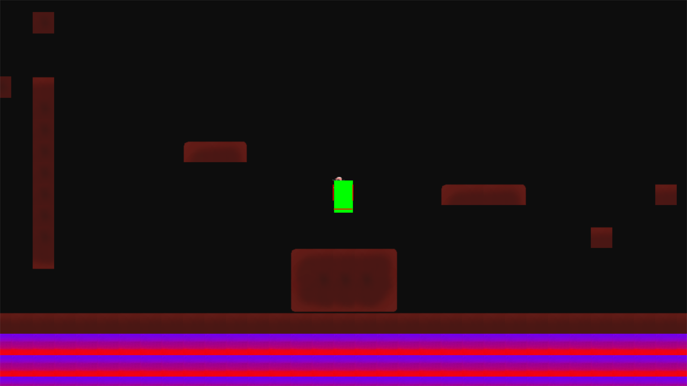

# PyGame-CE: Basic Game Engine and Platformer

PyGame-CE is a simple game engine developed in Python with basic physics and mechanics. This project includes a basic platformer game created using the engine within a week.



## Features

- **Physics Engine**: Implements basic physics like gravity, jumping, and collision detection.
- **Mechanics**: Supports player interactions including jumps, wall sticking, and movement.
- **Platformer Game**: Includes a sample platformer game built using the engine.

## Requirements

- Python 3.12
- Pygame library (`pip install pygame-ce`)

## Installation

1. Clone the repository:
   ```bash
   git clone https://github.com/AkitooSama/MyGame.git
